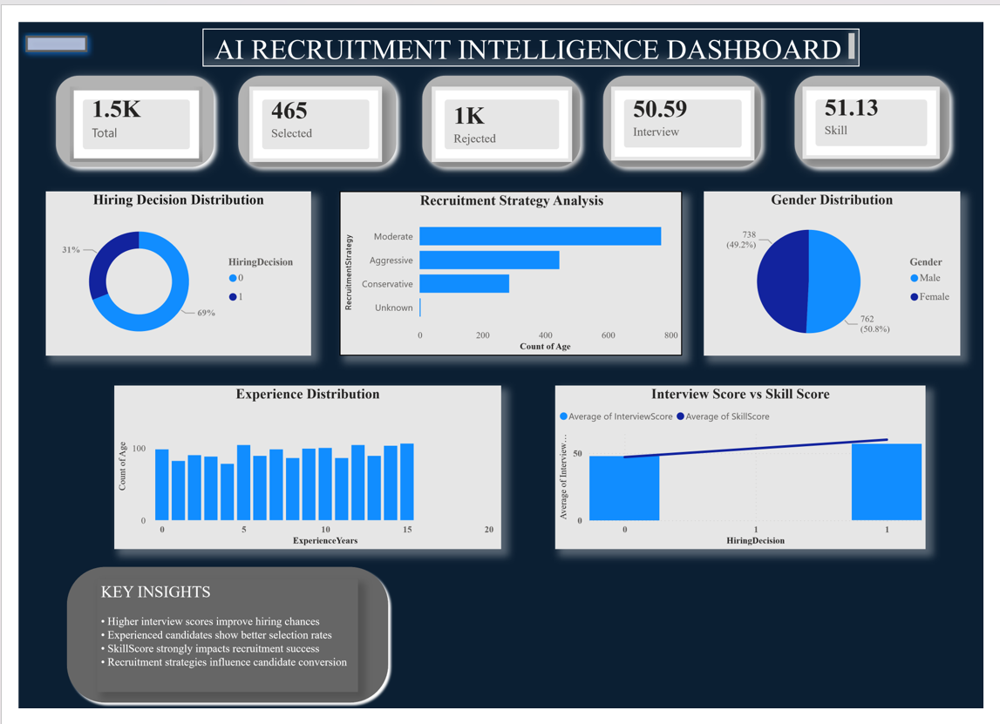
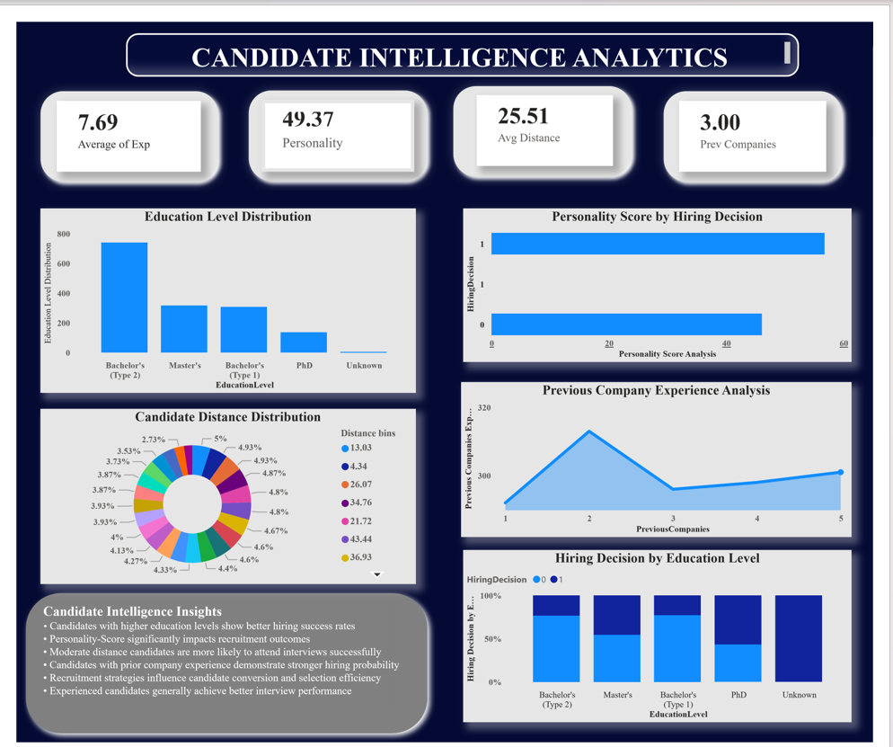
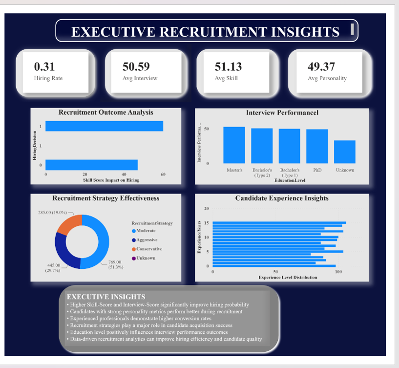

# Day 4 - AI Recruitment Intelligence Dashboard

## Project Overview


This project is part of my **31 Days Data Analytics & Data Science Challenge**.

In this project, I built an **AI Recruitment Intelligence Dashboard** using **Power BI, Python, and Data Analytics** techniques to analyze recruitment patterns, candidate hiring trends, interview performance, skill analysis, personality evaluation, education distribution, and recruitment strategies.

The goal of this project is to create a professional HR analytics system that helps understand candidate recruitment behavior and hiring intelligence using business analytics and dashboard storytelling.

---

# Tools & Technologies used

- Power BI
- Python
- Pandas
- NumPy
- Data Cleaning
- Business Intelligence
- KPI Analysis
- Dashboard Design
- Git & GitHub

---

# Dataset Features

The dataset contains recruitment-related candidate information including:

- Age
- Gender
- EducationLevel
- ExperienceYears
- PreviousCompanies
- DistanceFromCompany
- InterviewScore
- SkillScore
- PersonalityScore
- RecruitmentStrategy
- HiringDecision

---

# Dashboard Pages

## Page 1 — Recruitment Overview

This page provides an overview of the recruitment process using KPIs and business visuals.

### KPIs Included

- Total Candidates
- Selected Candidates
- Rejected Candidates
- Average Interview Score
- Average Skill Score

### Visuals Included

- Hiring Decision Distribution
- Recruitment Strategy Analysis
- Gender Distribution
- Experience Distribution
- Interview Score vs Skill Score

---

## Page 2 — Candidate Intelligence Analytics

This page focuses on candidate-level intelligence and profile analysis.

### Visuals Included

- Education Level Distribution
- Personality Score by Hiring Decision
- Candidate Distance Distribution
- Previous Company Experience Analysis
- Hiring Decision by Education Level
- Candidate Intelligence Insights

---

## Page 3 — Executive Insights & Recommendations

This page summarizes business insights and strategic recommendations.

### Insights Included

- Recruitment strategy effectiveness
- Candidate quality trends
- Hiring behavior analysis
- Experience and performance analysis
- Business recommendations for recruitment improvement

---

# KPIs Analyzed

- Total Candidates
- Hiring Success Rate
- Rejection Rate
- Average Skill Score
- Average Interview Score
- Personality Analysis
- Experience Analysis
- Recruitment Conversion

---

# Key Business Insights

- Candidates with higher interview scores show better hiring success rates.
- SkillScore strongly impacts recruitment outcomes.
- Experienced candidates generally perform better during interviews.
- Recruitment strategy influences candidate conversion efficiency.
- PersonalityScore contributes significantly to hiring decisions.
- Education level plays an important role in candidate selection.

---

# Dashboard of preview

## Recruitment Overview Dashboard



---

## Candidate Intelligence Dashboard



---

## Executive Insights Dashboard



---

# Project Workflow

1. Dataset Collection
2. Data Cleaning using Python
3. Data Preprocessing
4. KPI Planning
5. Power BI Dashboard Design
6. HR Analytics & Visualization
7. Executive Insight Generation
8. GitHub Documentation

---

# Project Structure

```bash
Day4_AI_Recruitment_Intelligence_Dashboard/
│
├── data/
│
├── cleaned_data/
│
├── notebook/
│   └── recruitment_cleaning_analysis.ipynb
│
├── powerbi_dashboard/
│   └── recruitment_intelligence_dashboard.pbix
│
├── screenshots/
│   ├── recruitment_overview.png
│   ├── candidate_intelligence.png
│   └── executive_insights.png
│
├── insights/
│   └── business_insights.txt
│
└── README.md
```
# Business Value

This dashboard helps organizations:

Understand recruitment performance
Analyze candidate quality
Improve hiring strategies
Monitor interview effectiveness
Optimize recruitment decisions
Generate data-driven HR insights

---
# Conclusion

This project helped me improve my practical understanding of:

HR Analytics
Power BI Dashboarding
Business Intelligence
Recruitment Analytics
KPI Analysis
Dashboard Storytelling
Candidate Intelligence Systems

It strengthened my ability to design professional and interactive dashboards for real-world business problems.
--

# Author

Gayatri Chavhan
Data Analytics | Power BI | Python | Business Intelligence | SQL


